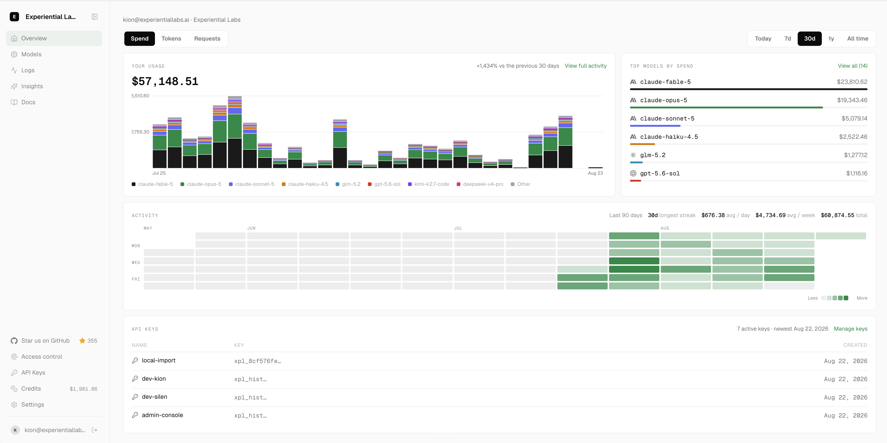

# TrustedRouterOnPrem

[](https://github.com/Lore-Hex/trustedrouter-onprem/actions/workflows/gate.yml)
[](https://github.com/Lore-Hex/trustedrouter-onprem/actions/workflows/gateway-latency.yml?query=branch%3Amain)
[](LICENSE)

TrustedRouterOnPrem is an open source model gateway for teams that want routing, identity,
budgets, and agent evaluation under their own control. It runs locally or on infrastructure you
operate.

The gateway provides:

1. An OpenAI-compatible local API for Chat Completions, Responses, and model discovery.
2. Per-key budgets, model aliases, routing policy, and request accounting.
3. Local trace ingestion, model evaluation, and router optimization.
4. TrustedRouter model access through `https://api.trustedrouter.com/v1`.
5. Optional customer-controlled direct BYOK connections and private-network model servers.

It never silently falls back from TrustedRouter to another public router.



## Install

TrustedRouterOnPrem currently installs directly from this repository:

```bash
python -m pip install "git+https://github.com/Lore-Hex/trustedrouter-onprem.git"
```

Create a key at [trustedrouter.com](https://trustedrouter.com/console/keys), then authenticate and
sync the models available to your account:

```bash
export TRUSTEDROUTER_API_KEY="sk-tr-v1-..."
tr-onprem login
tr-onprem
```

The first run creates a local gateway key and prints the loopback URL. Use those values with the
OpenAI SDK:

```python
from openai import OpenAI

client = OpenAI(
    base_url="http://127.0.0.1:8000/v1",
    api_key="<local gateway key>",
)

response = client.chat.completions.create(
    model="trustedrouter/auto",
    messages=[{"role": "user", "content": "What is the capital of France?"}],
)
print(response.choices[0].message.content)
```

See [SETUP.md](SETUP.md) for a prompt that an agent can execute and
[provider configuration](docs/reference/providers.md) for local and BYOK connections.

## Trust Boundary

TrustedRouterOnPrem holds local gateway state on infrastructure you control. Requests sent through
the managed model lane go only to `https://api.trustedrouter.com/v1`. TrustedRouter publishes the
source and attestation evidence for its hosted gateway at
[trust.trustedrouter.com](https://trust.trustedrouter.com).

Product telemetry is disabled by default in this fork. Prompts, responses, traces, credentials,
and local paths are never included in product telemetry.

## Development

```bash
uv sync --extra dev
uv run ruff check .
uv run ruff format --check .
uv run ty check
uv run pytest -q
```

The internal Python package remains `exp` as a compatibility boundary for reviewed upstream
updates. Public commands, package metadata, documentation, and UI use the TrustedRouterOnPrem
name.

## Upstream

TrustedRouterOnPrem is derived from
[Experiential](https://github.com/experientiallabs/experiential) at upstream commit
`c8220b0543ad6d5f426f831377f9efcd67be0aa1`. Experiential is Copyright 2026 Experiential Labs and
licensed under the Apache License 2.0. This derivative preserves the upstream license and records
reviewed upstream synchronization in [the upstream sync policy](docs/reference/upstream-sync.md).

TrustedRouterOnPrem is also licensed under the [Apache License 2.0](LICENSE).
